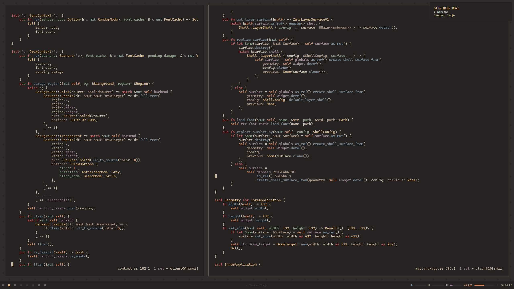

## Chocolate: A colorscheme for night dwellers

by Bryan: https://gitlab.com/snakedye/chocolate/-/blob/master/README.md?ref_type=heads&plain=1

### COLORS

|	accents	|	code	|
|-----------|-----------|
|	red		|	c65f5f	|
|	green	|	859e82	|
|	yellow	|	d9b27c	|
|	blue	|	728797	|
|	purple	|	998396	|
|	aqua	|	829e9b	|
|	beige	|	ab9382	|
|	orange	|	d08b65	|

|	background		|	code	|
|-------------------|-----------|
|	gray			|	3d3837	|
|	background		|	252221	|
|	background-1	|	262322	|
|	background-2	|	302c2b	|
|	background-3	|	3d3837	|
|	background-4	|	413c3a	|

|	foreground		|	code	|
|-------------------|-----------|
|	foreground		|	c8bAA4	|
|	foreground-1	|	cdc0ad	|
|	foreground-2	|	beae94	|
|	foreground-3	|	d1c6b4	|

### Guidelines

#### Accents priority

`yellow > green > purple > orange > aqua > beige`

#### Editor

|	color			|	recommendation			|
|-------------------|---------------------------|
|	gray			|	comments				|
|	background-3	|	selection				|
|	green			|	strings					|
|	yellow			|	most reccuring			|

### Example

### GREEN VERSION

|	accents	|	code	|
|-----------|-----------|
|	bg		|	202721	|
|	fg		|	D1D6BC	|
|	cursor		|	D1D6BC	|
|	black1		|	202721	|
|	black2		|	475249	|
|	red		|	ad7d49	|
|	green		|	7caa80	|
|	yellow		|	cbb871	|
|	blue		|	558b8b	|
|	magenta		|	878399	|
|	cyan		|	7fa294	|
|	white1		|	D1D6BC	|
|	white2		|	E0E6CA	|
